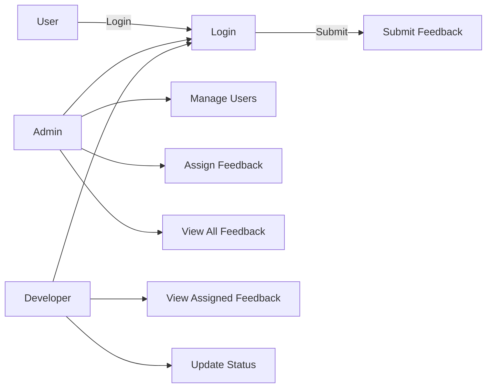
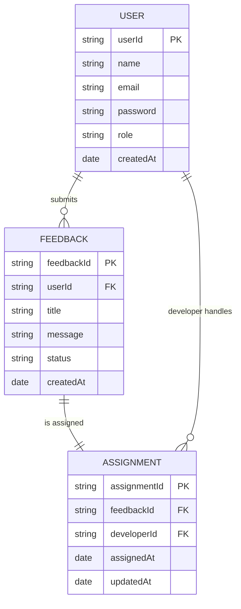

# Loopio-smart-grievance-and-feedback-management-system-

# Loopio – Full Stack Feedback Management System

Loopio is a modern full-stack feedback management system built with  
**React + Vite (Frontend)** and **Node.js + Express + MongoDB (Backend)**.  
The system allows users to submit feedback, track status, and manage their profile.  
Admins have access to all feedback, user management, and analytics.

---

## 🚀 Tech Stack

### 🌐 Frontend (React + Vite)
- React.js
- Vite
- React Router
- Axios
- Custom CSS / Loopio Theme Colors
- Component-based UI

### 🛠 Backend (Node.js + Express)
- Express.js (REST API)
- Mongoose (MongoDB ODM)
- JWT Authentication
- Bcrypt password hashing
- CORS enabled

### 🗄 Database
- MongoDB (Atlas or Local)
- Mongoose schema & model structure

---

## 📁 Folder Structure

```
project-root/
│
├── frontend/
│   ├── src/
│   ├── public/
│   ├── index.html
│   └── package.json
│
└── backend/
    ├── routes/
    ├── controllers/
    ├── models/
    ├── middleware/
    ├── config/
    ├── server.js
    └── package.json
```


 Loopio Brand Colors

| Name            | Hex Code  |
|-----------------|-----------|
| Loopio Blue     | #4A90E2   |
| Dark Navy       | #0B1A30   |
| Aqua Teal       | #27D6C8   |
| Soft White      | #F5F7FA   |
| Graphite Gray   | #3E4C59   |

These colors are applied across the UI for a clean, modern dashboard experience.

⚙️ How to Run the Project (Local)

 Frontend Setup (React + Vite)
 ```
 cd frontend
 
npm install

npm run dev
```
Frontend runs at:
http://localhost:5173/

Backend Setup (Node.js + MongoDB)
```
cd backend

npm install

npm start
```

Backend runs at:
http://localhost:5000/

## 🧩 Use Case Diagram



## 🗂️ Entity-Relationship (ER) Diagram



## 🔄 Workflow Diagram (User, Admin & Developer)

```mermaid
flowchart TD

    %% START
    A([START]) --> B([Login or Signup])

    %% Decision
    B --> C{Identify User Role}

    %% USER ROLE
    C -->|User| U1[User Dashboard]
    U1 --> U2[Submit Feedback]
    U2 --> U3[Feedback Saved in MongoDB]

    %% ADMIN ROLE
    C -->|Admin| A1[Admin Dashboard]
    A1 --> A2[View All Feedbacks]
    A2 --> A3[Assign Feedback to Developer]
    A3 --> U3
    A1 --> A4[Analytics and Reports]

    %% DEVELOPER ROLE
    C -->|Developer| D1[Developer Dashboard]
    D1 --> D2[View Assigned Feedback]
    D2 --> D3[Update Feedback Status]
    D3 --> D4[Status Saved in MongoDB]

    %% END
    U3 --> END([END])
    D4 --> END
    A4 --> END

